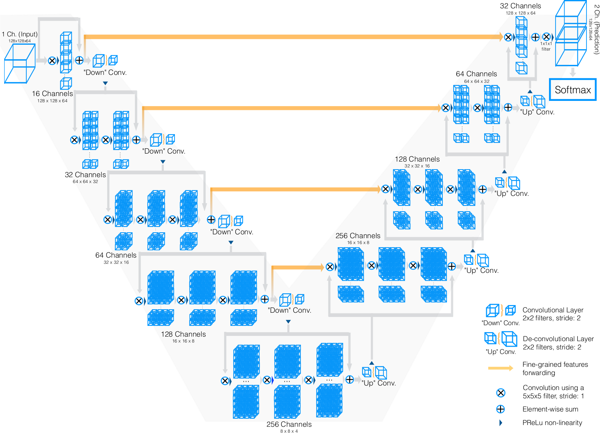
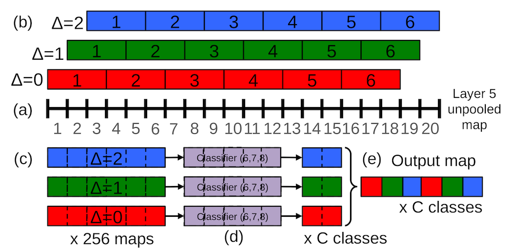
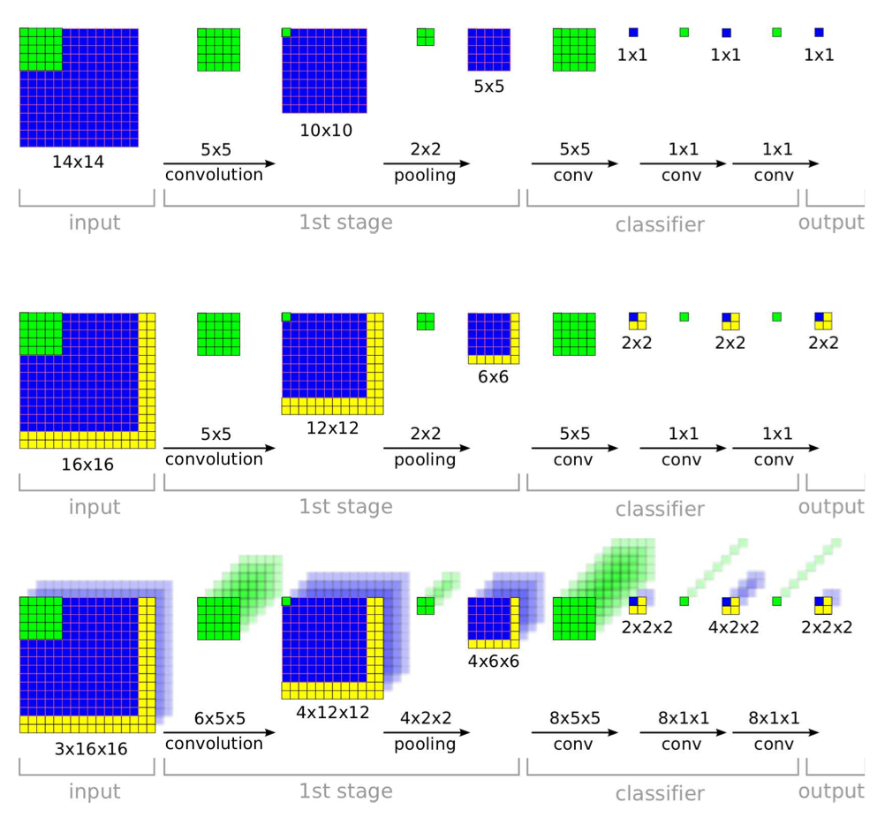
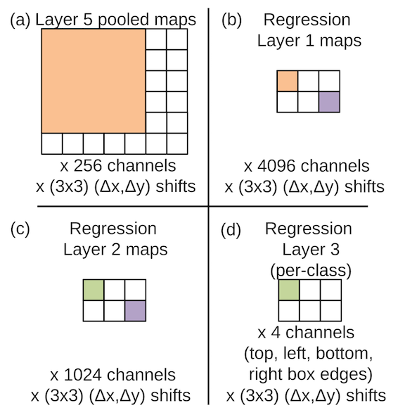

# Machine Learning Papers Notes
### Google’s Neural Machine Translation System: Bridging the Gap between Human and Machine Translation ([link](https://arxiv.org/pdf/1609.08144.pdf)) 
- Three inherent weaknesses of Neural Machine Translation (that prohibited NMT to overtake phrase based machine translation):
	1. Slower training and inference speed;
		- To improve training time: GNMT is based on LSTM RNNs, which have 8 layers with residual connections between the layers to encourage gradient flow. To improve inference time, low-precision arithmetic are used, further accelerated by google's TPU.
	2. ineffectiveness in dealing with rare words;  
		- To effectively deal with rare words: sub-word units ("wordpieces") were used for inputs and outputs.
	3. failure to translate all words in the source.
		- To translate all of the provided input, a beam search technique and a coverage penalty are used.
- Phrase-based machine translation (PBMT), as a type pf statistical machine translation method, has dominated machine translation for decades. NMT has been used as part of the PBMT and achieve promising results, but end-to-end learning based on NMT for machine translation has only started to surpass PBMT recently.
	- attention mechanism, character decoder, character encoder, subword units have been proposed to deal with rare words.
- GNMT is a sequence-to-sequence learning framework with attention. In order to achieve high accuracy, GNMT has to have deep enough encoder and decoder to capture subtle irregularities in the source and target.
- TBC

### DeepEM3D: Approaching human-level performance on 3D anisotropic EM image segmentation [link](https://academic.oup.com/bioinformatics/article-abstract/33/16/2555/3096435/DeepEM3D-approaching-human-level-performance-on-3D?redirectedFrom=fulltext)

### Sensor fusion [link](https://www.youtube.com/watch?v=xDDN8Q0hJos)
- 2 approchaes to sensor fusion
	- fuse input data from sensors before analysis
	- fuse analysis output data
- Prerequisites of sensor fusion
	- sensor synchronization using GPS
	- Localization in 6D
		- GPS is not reliable or accurate in urban canyons

		
### Fully Convolutinal Networks for Semantic Segmentation (FCN)
- [link](https://arxiv.org/abs/1605.06211)
- FCN adapts the classification networks for dense prediction, making it capable of localizatio tasks as well. Both learning and inference are performed whole-image-at-a-time.
- Architecture
	- Typical classifier nets take fixed-sized inputs.
	- **KEY STEP**: Fully connected (FC) layers can also be viewed as convolutions with kernels that cover their entire input regions. Doing so cast the classification nets to fully convolutional networks (FCN) that take **input of any size** and make spatial output maps. 
	- Although resulting maps are equivalent to the evaluation of original net on particular input image patches, the computation is **highly amortized** over the overlapping regions of those patches.
	- Although casting the nets to a fully convolutional manner will provide some localization information, the resulting image will be one with lower resolution due to max-pooling layers.
	- Addition of **skip connections** helps with the coarse prediction limited by the stride (due to **max-pooling**) of the convolution layers. This combines *where* (localizatino information from shallower layers) and *what* (classification information from deeper layers) of the network.
- Skip connections:

	- FCN-32s: Start with VGG-16 and convolutionalize the fully connected layer, perform 32x upscaling from the final stride-32 layer.
	- FCN-16s: Start with FCN-32s, concatenate stride-16 with 2x upscaled stride32 layers first, then perform a 16x upscaling. 
	- FCN-8s: Start with FCN-8s, concatenate stride-8 with 2x upscaled stride-16 layers and 4x upscaled stride-8 layers.
	- The 2x interpolation layers is initialized to bilinear interpolation
- Training
	- **Fine-tuning** only the final classification layer only yields 73% of the the full fine-tuning performance. 
	- Training all-at-once yeilds similar results to training in stages (FCN-32 first, then FCN-16, finally FCN-8) yields very similar results but only takes about half the time. However each stream needs to be scaled by a fixed constant to avoid divergence.
	- Class balancing: by weight or sampling the loss. ^(c.f. 3D U-net, ==need more investigation==) Mildly unlablanced datasets (1:3, e.g.) do not need rebalancing.
	- **Upsampling** needs to be defined as convolution for end-to-end training and inference. See details in this [blog](http://warmspringwinds.github.io/tensorflow/tf-slim/2016/11/22/upsampling-and-image-segmentation-with-tensorflow-and-tf-slim/).^(==need to read==)
- Evaluation
	- $n_{ij}$ is the number of pixels of class i predicted to be class j.
	- $t_i = \sum_j n_{ij}$ is the total number of pixels of class i.
	- pixel accuracy: $\sum_i n_{ii} / \sum_i t_i = \sum_i n_{ii} / \sum_{ij} n_{ij}$
	- mean accuracy: $(1/n_{cl}) \sum_i n_{ii}/t_i$
	- mean IU: $(1/n_{cl}) \sum_i n_{ii}/(t_i + \sum_j n_{ji} - n_{ii})$
- Momentum
	- Higher momentum is needed for batch size. $p^{1/k} = p'^{1/k'}$. For example, for momentun 0.9 and a batch size of 20, an equivalent training regime may be a momentum of $0.9^{1/20} \approx 0.99$ and a batch size of one, which is equivalent of **online learning**. In general, online learning yields better FCN models in less wall clock time.
	
- Extensions
	- [DIGITS 5 from Nvidia](https://devblogs.nvidia.com/parallelforall/image-segmentation-using-digits-5/)^(==need to read==)

### U-net: Convolutional Networks for Biomedical Image Segmentation
- [Link](https://lmb.informatik.uni-freiburg.de/people/ronneber/u-net/)
- From classification to localization (a class label is supposed to be assigned to each pixel)
- Ciresan trained a network in a sliding window setup to predict the label of each pixel by providing an image patch surrdounding it. 
	- Pros: 
		- able to localize
		- training data is much larger than the number of training images
	- Cons:
		- inefficient due to redundancies
		- tradeoff between localization accuracy (small image patches and the less use of pooling layer) and the use of context (large image patches)
- U-net is based on **fully convolutional netwowrk**.
- Architecture
	- Contracting layers + expanding (upsampling) layers
	- Concatenation with the correspondingly cropped feature map from the contracting path

- Data handling
	- Extrapolation by mirroring is used with valid padding on the boarder where data is missing.
	- Overlap-tile strategy is used to allow segmentation of arbitrarily large input.
	- Excessive data augmentation by applying **elastic deformation** for the network to learn such invariances. This is the key to train a segmentation network with very few (~30) annotated images.
	- Output is a series of map, each representing the probability of a pixel belonging to a certain class.
- Training
	- A large **momentum** (0.99) is used due to smaller batch size used (=1 image patch)
	- Deep neural networks usually has an objective with the form of a long shallow ravine leading to the optimum with steep walls on the sides. Standard SGD has very slow convergence rate after the initial steep gains. Momentum can be used to push the objective more quickly along the shallow ravine. [link](http://ufldl.stanford.edu/tutorial/supervised/OptimizationStochasticGradientDescent/) Therfore momentum update is almost always better than vanilla SGD. [CS231n](http://cs231n.github.io/neural-networks-3/#sgd)
	- Momentum is particularly important when using small batches because it allows derivatives to be integrated across batches. The smaller the batch size, the greater the momentum you may want to use. [link](http://tedlab.mit.edu/~dr/Lens/thumb.html)
- Evaluation
	- Review section in the summary of [ISBI-2012](http://journal.frontiersin.org/article/10.3389/fnana.2015.00142/full)
	- As segmentation algorithms are generally embedded in semiautomatic systems that enables human experts to correct the mistakes of the algorithms, it is useful to define a "nuisance metric", but it is highly subjective.
	- Human effort is required to correct **split errors** and **merge errors**, which can be used as proxies for the nuisance metric.
	- Pixrl error: the easiest measure of segmentation performance, but does not reflect the human effort involved to correct split or mergr error, thus inadequate.
	- **IOU** (IoU, intersection over union, or [Jaccard index](https://en.wikipedia.org/wiki/Jaccard_index)) is a widely used pixel error metric to evaluate segmenation algorithms (~90% is pretty good)
	- **Rand error**: non-local, region based method. More robust and best matches qualitative human judgement.
		- Define $p_{ij}$ as the probability that a pixel belonging to segment i in S (predicted segmentation) and segment j in T (ground truth segmentation). The joint probability distribution satisfies $\sum_{ij} p_{ij} = 1$ by definittion.
		- $s_i = \sum_j p_{ij}$ is the probability of a randomly chosen pixel belonging to segment i in S.
		$$
		V^{Rand}_{split} = \frac{\sum_{ij}p_{ij}^2}{\sum_k t_k^2}, \quad\quad V^{Rand}_{merge} = \frac{\sum_{ij}p_{ij}^2}{\sum_k s_k^2}.
		$$
		- The merge score $V^{Rand}_{merge}$ is the probability that two randomly chosen voxels belong to the same segment in T, given that they belong to the same segment in S. The merge score is higher when there are fewer merge errors. The split score is defined similarly.
		- The Rand F-score is defined as the weighted harmonic mean
		$$
		V_\alpha^{Rand} = \frac {\sum_{ij} p^2_{ij}} 
		{\alpha \sum_k s_k^2 + (1-\alpha) \sum_k t_k^2}
		$$
		Generally $\alpha = 0.5$, which weighs split and merge errors equally. The Rand score is closely related to the Rand index.
		
		
### 3D U-Net: Learning Dense Volumetric Segmentation from Sparse Annotation
- [Link](https://arxiv.org/abs/1606.06650)
- 3D U-net is an end-to-end training scheme for 3D (biomedical) image segmentation based on the 2D counterpart U-net. It also has the analysis (contracting) and synthesis (expanding) paths, connected with skip (shortcut) connections.

- 3D U-net takes 3D volumes as input and process them with 3D operations (3D convolution, 3D max pooling, 3D up-convolution). 
- Biomedical images has the special advantage that properly applied rigid transformations and slight elastic deformations still yield **biologically plausible** images. In addition, each image already comprise repetitive structures with corresponding variations. Combined they allow efficient training of neural networks on sparsely annotated data. (In 3D, 2 volumes are enough to train a network from scratch and perform segmentation on the 3rd volume.)
- Batch normalization (BN) is used in preference to previously used He initialization (Gaussian distribution with $\sigma=\sqrt{2/N}$) for faster convergence.
- Weighted softmax loss function (0 for unlabled regions as they do not contribute to loss function, reduced weighting for frequently seen background, and increased weighting for rare classes, in the interest of more balanced influence from different classes on loss function)
- Results
	- BN: better accuracy (IoU) is achieved with BN
	- 3D context: contributes positively to the segmentation accuracy (compared with treating each slice independently).
	- Number of slices: diminishing return after a few slices (a couple of percentage of total number)

### V-Net: fully Convolutional Neural Network for Volumentric Medical Image Segmentation
- [Link](https://arxiv.org/abs/1606.04797)
- V-net improves upon U-net in two aspects:
	- Capable of performing 3D operations (like 3D U-net)
	- Added residual connections between the first and last steps of each stage of convolution layers (between pooling operatios)
		- redisual connections lead to faster convergence
	- Replaced pooling operations with convolutinal ones
		- cf: the all convolutional net (arXiv:1412:6806)^(==to read==)
		- smaller memory footprint (no switches mapping the poutput of pooling layers back to the inouts are needed for backprob)^(==why? How does backprob work in pooling layers?==)

- Objective function based on Dice coefficient
	- [Dice coefficient](https://en.wikipedia.org/wiki/S%C3%B8rensen%E2%80%93Dice_coefficient): a statistic used for comparing the similarity of two samples
	- $S={\frac {2|X\cap Y|}{|X|+|Y|}}$, which is related to Jaccard index (IoU), $J=\frac{|X \cap Y|}{|X \cup Y|}$, in that $S = 2J/(1+J)$ and both $S, J \in (0, 1)$.
	- The improved loss function is:
	$$
	D = \frac{2\sum_i^N p_i g_i}
			  {\sum_i^N p_i^2 + \sum_i^N g_i^2},
	$$ where predicted binary segmentation $p_i \in P$ and ground truth binary volume $g_i \in G$. This Dice coefficient can be differntiated $\partial D/\partial p_j$ with respect to the $j$-th voxel of prediction.
	- The authors *claimed* that using this loss function eliminates the need to adjust the weight of loss for different classes to address class imblancement.^(==Why?==)
- Training
	- Data augmentation performed on-the-fly to avoid the othewise excessive storage requirement. 2x2x2 control points and B-spline interpolation
	- High momentum of 0.99, following U-net.
- Inference
	- The input images are **resampled** to a common resolution of the input images. This should be necessary for preprocessing of input data as well.
- Additional notes:
	- The main capability of CNN is to learn a hierarchical representation of raw input data, without replying on handcrafted features. 
	- The naive solution to segmentation uses patchwise classification but only considers local context and suffers from efficiency issues too.
	- To avoid information bottleneck, the number of channels doubles when the resolution of the images halves.

## R-CNN: From Classification to Detection to Segmentation
The evolvement from R-CNN (regions with CNN-features), Fast R-CNN, Faster R-CNN and Mask R-CNN.

### R-CNN: Rich feature hierarchies for acurate object detection and semantic segmentation, Tech Report v5
- [Link](https://arxiv.org/abs/1311.2524), [link ppt](https://courses.cs.washington.edu/courses/cse590v/14au/cse590v_wk1_rcnn.pdf)
- Two ways to alleviate the problem of limited availability of annotated data: 
	- data augmentation
	- **supervised** pre-training prior to domain specific fine-tuning (transfer learning).
- [General] Before CNN dominates ILSVRC, ensemble systems that combine multiple low-level image features (HOG-like, e.g.) with high-level context were taking the lead. In retrospect, this also generates hierarchical features, the same as CNN.
- [General] AlexNet's twists on top of LeCun's CNN: use of ReLu activation function and dropout regularization.
- R-CNN explores the question of how to transfer CNN classification results to object detection.
- Architecture:
	- Region proposal: ~2000 (rectangular) category-independent regions for each input image are proposed on the fly by **selective search**.
	- **Affine warping** each region into the input size of CNN (e.g., 227x227 for AlexNet). This generates a fixed length feature (4096-dimensional for AlexNet).
	- Category-specific **SVM** to classify each region.

- Training:
	- Pre-training with large dataset (ImageNet) with image-level annotations only
	- Fine-tuning on small dataset (PSACAL). Proposed regions with labels are also needed for training to match the test inference application. Such rraining data are generated by assigning labels to the regions proposed by selective search based according to the IoU value with the ground truth (assign ground truth box's label to proposed region if they have >= 0.5 IoU overlap).
		- Bounding box **dilation** helps to increase detection accuracy.
		- Fine-tuning the whole net yields beter results than using CNN as a blackbox feature extractor without fine-tuning.
	- With features extracted (using fine-tuned network) and training labels assigned, we optimize one linear SVM per class. Standard hard negative mining method^(==to read==) was used.
	- Note that it is possible to obtain close to the same level of performance withotu training SVMs after fine-tuning. The SVM was a historical artifact as it was first used on featured extracted by blackbox AlexNet without fine-tuning.
- Inference:
	- The main metric was mAP^(==How was it defined?==)
- Visualization of learned features
	- First layer capture oriented edges, patterns and blobs.
	- For more complex features in subsequent layers, e.g. pool_5 (last layer before FC layers in AlexNet), Compute a particular unit (feature) and compute the unit's actitvation on a held-out regions, sort the regions by activation, apply non-maximum suppression. This method let the selected unit **speak for itself** by showing exactly which inputs it fires on.
- [**Ablation study**](https://www.quora.com/In-the-context-of-deep-learning-what-is-an-ablation-study) studies the performance of the network by removing some features from the network, e.g., each layer.
	- This is a great tool to examine which layers are critical for determining performance. It showed without fine-tuning, the final FC layer can be deleted (with 30% of all parameters) without hurting the accuracy.
	- It also reveals that much of CNN's reprensentational power  comes form the convolutional layers rather than from the much larger densely connected layers.
- Base architecture of choice
	- AlexNet was used as a fast baseline
	- VGG-16 can yield better performnance but at 7 times longer inference time.
- Dataset usage considerations
	- ILSVRC detection dataset has training, val, test sets. The training set is drawn from the classification task and is not exaustively annoated. The val and test sets were drawn from the same image distribution and are exaustively annotated.
	- Selective search is not scale invariant and thus all images are rescaled for region proposal.
	- Training cannot be relied only on training set as it is from a different image distribution. Val set is split roughly evenly into $val_1$ and $val_2$.
	- During training, $val_1$ and training set are used, and $val_1$ is used for hard negative mining (as it was exaustively annotated and training set was not).
- R-CNN for Semantic segmentation
	- Uses **CPMC** instead of selective search for region proposal
	- Uses foreground information in a bounding box (as two regions may have little overlap but have the same bounding box, e.g., ◪ and ◩)
	- Again, this is region based but not pixel based.
- Bounding box regression
	- It was found that the localization error was the main contribution to mAP error so a linear regressor based on the extracted features from pool_5 (last layer before FC layers) was used to transform the proposed bounding box $P$ to ground truth bounding box $G$. Only closely located (P, G) pairs were used for training (IoU > 0.6).
- Relation with [OverFeat](#overfeat)
	- OverFeat uses multiscale pyramid of sliding window.
	- OverFeat is faster than R-CNN (to be improved by fast and faster R-CNN)
- R-CNN is "efficient" in two ways:
	- CNN parameters shared across all categories
	- feature vectors extracted by CNN are low-dimensional compared to conventional CV algorithms.
	- However, compuation is still **inefficient** due to possible large overlaps among proposed regions.

### <a name="overfeat">OverFeat: Integrated Recognition, Localization and Detection using Convolutional Networks</a>
- Overview
	- First publication on explaining how to use CNN to perform localization and detection. (AlexNet paper was focused on classification)
	- Proposed a aggregation method to combine many localization predictions. This eliminates the need to train on background samples.
	- Segmentation preprocessing or object proposal steps (e.g., selective search) drastically reduce unlikely object regions hence reducing false postives (e.g., R-CNN). 
		- Overfeat was able to win ILSVRC2013 localization using aggregation of localization predictions without resorting to object proposal step, but it was overtaken by R-CNN by a large margin.
- Detection vs localization
	- Largely the same
	- Detection dataset is more challenging as it contains many small objects while classification/localization typically contain a single large object. It can contain any number of objects (including 0) and thus false positives are penalized.
- Multiscale Classification (6 sizes of input images were used)
	- 3 steps:
		1. A spatial feature map is generated for each scale. The spatial max was selected.
		2. This leads to a C-dim (# of classes) vector at each scale. All vectors were averaged into a mean class vector
		3. from which top element(s) were selected. 
	- Note that this multiscale does not lead to huge improvement in classification. However, there are two interesting concepts.
	- A **shift-and-stitch** method were used to enhance the image resolution after convolution. 

	- Sliding window is generally computationally intensive but it **inherently efficient** with CNN due to heavily amortized computation over overlaped windows. 

- Localization
	- Use pool_5 features to train a regressor network, 256 -> 4096 -> 1024 -> 4.

	- Each scale (6) and offset (3x3) generate a bounding box prediction, so there are a max of 54 bounding boxes for a single object. A **greedy merge strategy** are used to merge these bounding boxes together:
		1. $ (b'_1, b'_2) = \underset{b_1 \ne b_2 \in B}{argmin} \texttt{ match_score}(b_1, b_2) $
		2. 	If $\texttt{match_score}(b'_1, b'_2) > t$, stop
		3. Otherwise, set $B \leftarrow B\backslash {b'_1, b'_2} \cup \texttt{box_merge} (b'_1, b'_2)$
	- Compute `match_score` using sum of distance between centers of bounding boxes to the intersection of the boxes. `box_merge` compute the average of the bounding boxes coordinates.
	- This method is very robust to false positive than non-maximum suppresion by rewarding bounding box coherence.
- Detection
	- Very similar to localization except the necessity to predict a background class when no object is present.
	- **Bootstrapping** is used in training on negative examples^(==hard negative mining?==) 
- Limitations to be improved
	- Layers up to pool_5 are used as a blackbox feature extractor in localization. Fine-tuning (backprop all the way back) in localizaiton may give better result.

## Blogs, Websites, slides, etc
- DeepLearningJP2016 [@SlideShares](https://www.slideshare.net/DeepLearningJP2016/presentations)

	
	
	
	
	
	
	
	