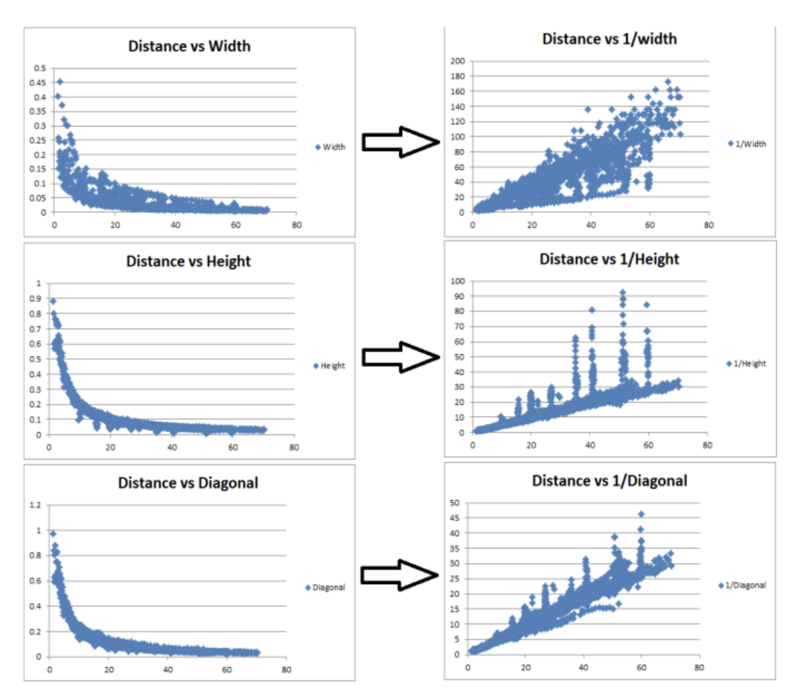

# [DisNet: A novel method for distance estimation from monocular camera](https://project.inria.fr/ppniv18/files/2018/10/paper22.pdf)

_October 2019_

tl;dr: Summary of the main idea.

#### Overall impression
Use bbox H, W, D (diagnal), average size of object h, w, b (breadth, along depth dimension) is good enough to regress the distance, with relative error ~10%, up to 300 meters.

This method seems much more promising than the one presented in [object distance estimation](obj_dist_iccv2019.md).

#### Key ideas
- Distance of 1/W (or 1/D, 1/H) are all approximately linear with distance. 

#### Technical details
- 2000 bbox are used. Distance GT measured with laser scanner. 

#### Notes
- We can add the backplane width for better estimation of depth. 
- The method to extract GT information from point cloud may be noisy. But how to quantify and avoid this?